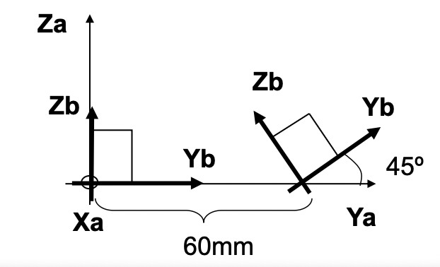

## **Exercise 1**

**Assuming you have a Brick sized (40mm, 20mm, 15mm) and we make a translation and rotation in function of Mobile frame,**

**a) Find the Pose of Bframe respect World if pose of Aframe is (30,40,50,0,0,0)**

**b) Find the position of the center of gravity of brick with respect to the Bframe, before and after processing the movement**

**c) Find the position of the center of gravity of brick with respect to the A-frame, before and after processing the movement**

**d) Solve also the three previous questions analytically and using roboDK**

---

**a) Find the Pose of Bframe respect World if pose of Aframe is (30,40,50,0,0,0)**

To compute the pose of the B-frame with respect to the World frame, we need to construct a **homogeneous transformation matrix (HT)**. This matrix combines both a translation and a rotation, applied in sequence, to describe the pose of an object or coordinate system in 3D space.

According to the diagram, the B-frame is first translated by **(0, 60, 0)** with respect the coordinate system of the B-frame. Then, a **rotation of 45° is applied around the X-axis of the mobile frame (Xb)**.

We represent the transformation from A-frame to B-frame as the product of a translation and a rotation, in this order because the transformations are made with respect to the mobile B-frame:

$$
^{Aframe}Pose_{Bframe} = T(0, 60, 0) \cdot R_x(45^\circ)
$$

Where:

- $T(0, 60, 0)$ is a translation of 60 mm along the Y-axis of the B-frame.

- $R_x(45^\circ)$ is a rotation of 45° around the X-axis of the B-frame.

Translation matrix:
$$
T(0, 60, 0) =
\begin{bmatrix}
1 & 0 & 0 & 0 \\
0 & 1 & 0 & 60 \\
0 & 0 & 1 & 0 \\
0 & 0 & 0 & 1
\end{bmatrix}
$$

Rotation matrix about the X-axis:
$$
R_x(45^\circ) =
\begin{bmatrix}
1 & 0 & 0 & 0 \\
0 & \cos(45^\circ) & -\sin(45^\circ) & 0 \\
0 & \sin(45^\circ) & \cos(45^\circ) & 0 \\
0 & 0 & 0 & 1
\end{bmatrix}
$$

The Pose of the B-frame with respect to the A-frame can be expressed as:
$$
^{Aframe}Pose_{Bframe} =
\begin{bmatrix}
1 & 0 & 0 & 0 \\
0 & \cos(45^\circ) & -\sin(45^\circ) & 60 \\
0 & \sin(45^\circ) & \cos(45^\circ) & 0 \\
0 & 0 & 0 & 1
\end{bmatrix}
$$

We are given that the pose of the A-frame with respect to the World frame is:

$$
^{World}Pose_{Aframe} =
\begin{bmatrix}
1 & 0 & 0 & 30 \\
0 & 1 & 0 & 40 \\
0 & 0 & 1 & 50 \\
0 & 0 & 0 & 1
\end{bmatrix}
$$

This means that the origin of the A-frame is located at coordinates (30, 40, 50), and it is aligned with the World coordinate system (no rotation).

**Final pose of the B-frame with respect to the world**

The final pose of the B-frame is obtained by:

$$
^{World}Pose_{Bframe} = ^{World}Pose_{Aframe} \cdot ^{Aframe}Pose_{Bframe}
$$

This operation results in:

$$
^{World}Pose_{Bframe} =
\begin{bmatrix}
1 & 0 & 0 & 30 \\
0 & \cos(45^\circ) & -\sin(45^\circ) & 100 \\
0 & \sin(45^\circ) & \cos(45^\circ) & 50 \\
0 & 0 & 0 & 1
\end{bmatrix}
$$

This final matrix indicates that the B-frame is positioned at **(30, 100, 50)** and has undergone a **rotation of 45° around its local X-axis** relative to the A-frame.

**The position of CG of the brick with respect to the World after the movement is:**

$$
^{World}CG_{after} = ^{World}HT_{Bframe} \cdot ^{Bframe}CG
$$

This operation results in:

$$
^{World}Pose_{after} = (50, 98.2, 62.4, 1)
$$

---

---
**b) Find the position of the center of gravity of brick with respect to the Bframe, before and after processing the movement**

Brick dimensions

- Length (X): 40 mm  
- Width (Y): 15 mm  
- Height (Z): 20 mm

The center of gravity of a rectangular solid is located at its geometric center:

$$
^{Bframe}CG =
\left(
\frac{40}{2},\ \frac{15}{2},\ \frac{20}{2}
\right)
=
(20,\ 7.5,\ 10)
$$

**Before the movement**

The brick is initially placed in the B-frame without any offset or rotation. Therefore, the center of gravity with respect to the B-frame is:

$$
^{Bframe}CG_{before} = (20,\ 7.5,\ 10)
$$

**After the movement**

Since the B-frame is moved as a rigid body and the brick is fixed to it, the center of gravity of the brick **does not change with respect to the B-frame**:

$$
^{Bframe}CG_{after} = (20,\ 7.5,\ 10)
$$

---

---

**c) Find the position of the center of gravity of brick with respect to the A-frame, before and after processing the movement**

From section **b)**, the CG in B-frame coordinates is:

$
^{Bframe}CG = (20,\ 7.5,\ 10)
$

**Before the movement**

Before applying any transformation, the B-frame is aligned with the A-frame at the same position and orientation. Therefore, the CG expressed in the A-frame is exactly the same:

$$
^{Aframe}CG_{before} = ^{Bframe}CG = (20,\ 7.5,\ 10)
$$

**After the movement**

To express the CG with respect to the A-frame **after** the movement, we must apply:

Let:

- $^{Bframe}CG$: coordinates of the center of gravity in B-frame
- $^{Aframe}Pose_{Bframe}$: transformation from B-frame to A-frame (defined in part a)

We apply:

$$
^{Aframe}CG_{after} = ^{Aframe}Pose_{Bframe} \cdot ^{Bframe}CG
$$

Using:

$$
^{Aframe}Pose_{Bframe} =
\begin{bmatrix}
1 & 0 & 0 & 0 \\
0 & \cos(45^\circ) & -\sin(45^\circ) & 60 \\
0 & \sin(45^\circ) & \cos(45^\circ) & 0 \\
0 & 0 & 0 & 1
\end{bmatrix}
$$

and

$$
^{Bframe}CG =
\begin{bmatrix}
20 \\
7.5 \\
10 \\
1
\end{bmatrix}
$$

we compute the product:

$$
^{Aframe}CG_{after} =
\begin{bmatrix}
20 \\
60 + 7.5\cos(45^\circ) - 10\sin(45^\circ) \\
7.5\sin(45^\circ) + 10\cos(45^\circ) \\
1
\end{bmatrix}
$$

By replacing $\cos(45^\circ)$ and $\sin(45^\circ)$ with 0.7071, we get the position of the center of gravity after the movement:

$$
^{Aframe}CG_{after} \approx (20,\ 58.23,\ 12.37, 1)
$$

---

---

**d) Solve also the three previous questions analytically and using roboDK**

We can generate:
- The complete document in Markdown and save it on a file called "Exemple1_auto.md"
- The complete python code and save it on a file called "Exemple1_auto.py" 

---

We can run the generated "Exemple1_auto.py" verify we obtain the same results.

